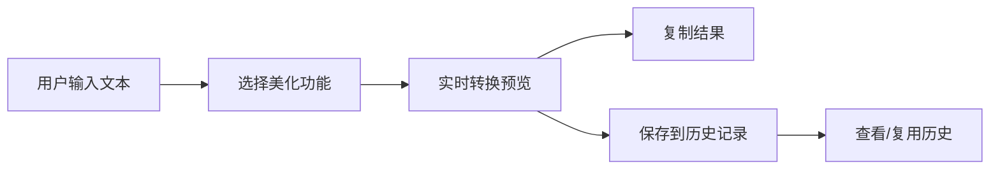

## 1. 产品概述

字符样式美化工具是一款纯前端在线工具，帮助用户快速将普通文本转换为各种花式样式，适用于社交媒体、聊天场景、创意写作等。

- **核心价值**：提供一站式文本美化解决方案，无需下载安装，浏览器即可使用
- **目标用户**：社交媒体创作者、聊天达人、文案编辑、设计爱好者
- **市场定位**：轻量级、功能全面的在线文本美化工具

## 2. 核心功能

### 2.1 功能模块

1. **首页**：包含所有功能模块的单页应用
   - 文本输入区
   - 花式字体转换区
   - 符号装饰区
   - 格式处理区
   - 快捷操作区
   - 历史记录区

### 2.2 页面详情

| 页面名称 | 模块名称 | 功能描述 |
|-----------|-------------|---------------------|
| 首页 | 文本输入区 | 多行文本输入，支持粘贴，实时监听内容变化，字数统计 |
| 首页 | 花式字体转换 | 特殊符号字体、空心字、粗体、斜体、颠倒文字、拼音标注，实时预览效果 |
| 首页 | 符号装饰 | 前后缀花边、分割线、表情符号点缀，支持自定义符号输入 |
| 首页 | 格式处理 | 空格压缩、大小写切换、去换行、首尾去空格，一键应用 |
| 首页 | 快捷操作 | 全选文本、复制结果、清空内容、历史记录（保存最近10条） |
| 首页 | 主题切换 | 深色/浅色模式切换，本地存储用户偏好 |

## 3. 核心流程

用户输入文本 → 选择美化功能（字体/装饰/格式）→ 实时预览转换效果 → 复制结果/保存历史

## 4. 用户界面设计

### 4.1 设计风格

- **主色调**：采用渐变蓝紫色系（#6366f1 到 #8b5cf6），营造现代科技感
- **辅助色**：柔和的珊瑚粉（#f472b6）用于强调按钮和交互元素
- **中性色**：使用 slate 色系作为文本和背景，确保可读性
- **按钮样式**：圆角矩形按钮，hover 时有轻微上浮和阴影变化
- **字体**：
  - 标题：使用 'Noto Sans SC' 或系统无衬线字体，字重 600-700
  - 正文：使用系统无衬线字体，字重 400
  - 等宽区域：使用 'JetBrains Mono' 或等宽字体展示转换结果
- **布局风格**：卡片式布局，功能模块分区明确，留白充足
- **图标**：使用 lucide-vue-next 图标库，风格统一简洁
- **动效**：
  - 页面加载：元素渐入动画，错落延迟
  - 按钮交互：缩放 + 阴影过渡
  - 结果展示：淡入 + 轻微滑入效果
  - 复制成功：toast 提示动画

### 4.2 页面设计概述

| 页面名称 | 模块名称 | UI Elements |
|-----------|-------------|-------------|
| 首页 | 头部导航 | Logo、标题、主题切换按钮，渐变背景 |
| 首页 | 文本输入区 | 大文本框，placeholder 提示，实时字数统计，底部操作按钮 |
| 首页 | 功能区 | Tab 切换或分区展示，每个功能区有独立的操作按钮和预览区域 |
| 首页 | 转换结果区 | 卡片展示，支持一键复制，多种结果并列展示 |
| 首页 | 历史记录 | 可折叠侧边栏或底部区域，展示最近10条记录 |
| 首页 | 页脚 | 简洁版权信息，操作提示 |

### 4.3 响应性

- **设计原则**：桌面优先，移动端自适应
- **断点设置**：
  - 桌面端：≥ 1024px，三栏布局（输入区 + 功能区 + 结果区）
  - 平板端：768px - 1023px，两栏布局（输入区在上，功能区和结果区并列）
  - 移动端：< 768px，单列布局，所有模块垂直堆叠
- **触摸优化**：移动端按钮最小尺寸 44px × 44px，增加点击区域
- **交互适配**：桌面端 hover 效果，移动端 focus 状态替代

### 4.4 深色模式

- 深色背景使用 #0f172a（深蓝灰），避免纯黑减少视觉疲劳
- 文本对比度不低于 4.5:1，确保可读性
- 边界使用细微边框而非阴影，营造层次感
- 渐变色在深色模式下调整为更深的色调
