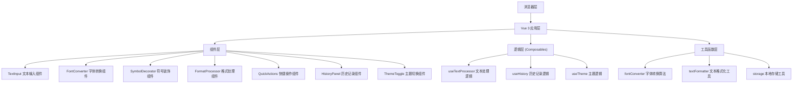

## 1. 架构设计

本项目为纯前端单页应用，无需后端服务，所有功能在浏览器端完成。



## 2. 技术描述

- **前端框架**：Vue 3 + TypeScript + Vite
- **样式方案**：Tailwind CSS 3
- **图标库**：lucide-vue-next
- **状态管理**：Vue 3 Composition API (reactive/ref)
- **数据持久化**：localStorage 存储历史记录和主题偏好
- **初始化工具**：vite-init 使用 vue-ts 模板

## 3. 目录结构

```
src/
├── components/
│   ├── TextInput.vue          # 文本输入组件
│   ├── FontConverter.vue      # 花式字体转换组件
│   ├── SymbolDecorator.vue    # 符号装饰组件
│   ├── FormatProcessor.vue    # 格式处理组件
│   ├── QuickActions.vue       # 快捷操作组件
│   ├── HistoryPanel.vue       # 历史记录组件
│   ├── ThemeToggle.vue        # 主题切换组件
│   └── ResultCard.vue         # 结果展示卡片
├── composables/
│   ├── useTextProcessor.ts    # 文本处理逻辑
│   ├── useHistory.ts          # 历史记录管理
│   └── useTheme.ts            # 主题切换逻辑
├── utils/
│   ├── fontConverter.ts       # 字体转换算法
│   ├── textFormatter.ts       # 文本格式化工具
│   └── storage.ts             # 本地存储工具
├── types/
│   └── index.ts               # TypeScript 类型定义
├── App.vue                    # 根组件
├── main.ts                    # 入口文件
└── style.css                  # 全局样式
```

## 4. 核心数据结构

### 4.1 类型定义

```typescript
// 历史记录项
interface HistoryItem {
  id: string;
  originalText: string;
  convertedText: string;
  type: 'font' | 'symbol' | 'format';
  timestamp: number;
}

// 字体转换类型
type FontStyle = 
  | 'bold' 
  | 'italic' 
  | 'outline' 
  | 'symbol' 
  | 'reverse' 
  | 'pinyin';

// 符号装饰类型
interface SymbolStyle {
  id: string;
  name: string;
  prefix: string;
  suffix: string;
}

// 格式处理类型
type FormatAction = 
  | 'compressSpaces' 
  | 'toUpperCase' 
  | 'toLowerCase' 
  | 'removeNewlines' 
  | 'trim';
```

### 4.2 字体映射表

使用 Unicode 字符映射实现各种字体效果：

```typescript
// 粗体字母映射 (Mathematical Bold)
const boldMap: Record<string, string> = {
  'A': '𝐀', 'B': '𝐁', ..., 'Z': '𝐙',
  'a': '𝐚', 'b': '𝐛', ..., 'z': '𝐳',
  '0': '𝟎', '1': '𝟏', ..., '9': '𝟗'
};

// 斜体字母映射 (Mathematical Italic)
const italicMap: Record<string, string> = {
  'A': '𝐴', 'B': '𝐵', ...
};

// 空心字映射 (Mathematical Double-Struck)
const outlineMap: Record<string, string> = {
  'A': '𝔸', 'B': '𝔹', ...
};

// 特殊符号字体映射
const symbolMap: Record<string, string> = {
  'A': '𝓐', 'B': '𝓑', ... // 手写体、花体等
};
```

## 5. 核心功能实现方案

### 5.1 花式字体转换

- **字符映射法**：使用 Unicode 特殊字符区域（如 Mathematical Alphanumeric Symbols）实现字体效果
- **颠倒文字**：使用翻转字符映射表 + 字符串反转实现
- **拼音标注**：使用 pinyin-pro 库（可选）或内置拼音映射表

### 5.2 符号装饰

- **预设花边库**：内置多种常用符号组合（如 `✿`、`★`、`═`、`༺` 等）
- **自定义符号**：用户可输入自定义前后缀符号
- **分割线生成**：根据输入长度自动生成对应长度的装饰线

### 5.3 历史记录

- 使用 localStorage 存储最近 10 条记录
- 按时间倒序排列
- 支持一键复用历史记录

### 5.4 主题切换

- 使用 CSS 变量 + Tailwind dark 模式
- 主题偏好存储在 localStorage
- 支持跟随系统主题

## 6. 性能优化

- **实时转换防抖**：输入时使用 debounce 避免频繁计算
- **虚拟滚动**：历史记录较多时使用虚拟滚动
- **懒加载**：非核心功能组件按需加载
- **字体优化**：使用系统字体栈，避免 Web 字体加载延迟

## 7. 依赖包

```json
{
  "dependencies": {
    "vue": "^3.4.0",
    "lucide-vue-next": "^0.300.0"
  },
  "devDependencies": {
    "@vitejs/plugin-vue": "^5.0.0",
    "autoprefixer": "^10.4.16",
    "postcss": "^8.4.32",
    "tailwindcss": "^3.4.0",
    "typescript": "^5.3.0",
    "vite": "^5.0.0",
    "vue-tsc": "^1.8.27"
  }
}
```
